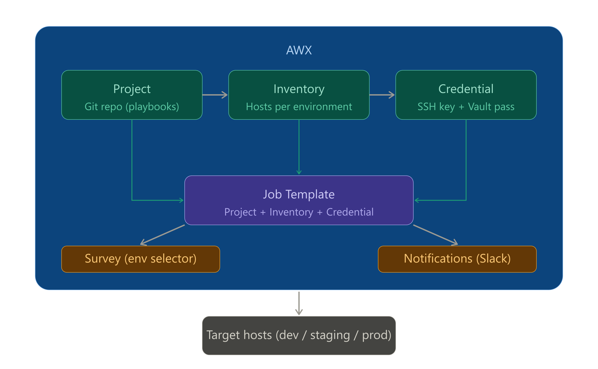

# 3-Tier Node.js App Provisioning with Ansible & AWX on AWS

Built an automated 3-tier application deployment system using Ansible and AWX that provisions and configures frontend, backend, and database servers on AWS with environment-based configurations and secure secret management.


---

---

## Project Overview

This project provisions and configures a complete 3-tier web application on AWS using Ansible and AWX. It covers everything from designing a production-grade VPC network to deploying a React frontend, Node.js backend, and MySQL database across separate EC2 instances — all automated through a single AWX Job Template.

AWX (the open-source version of Ansible Tower) acts as the control plane. It pulls playbooks from GitHub, manages credentials securely, and executes provisioning across all servers in the correct order with a single click.

The application itself is a user management system with JWT authentication, built with React, Node.js/Express, and MySQL — running across a properly segmented AWS network with public and private subnets.

---

## Project Description

### What Was Built

A fully automated infrastructure provisioning system for a 3-tier Node.js application on AWS, orchestrated through AWX running on Kubernetes (k3s).

**The 3 tiers:**

| Tier | Technology | Location |
|---|---|---|
| Web / Frontend | React.js served via Nginx | Public subnet (internet-facing) |
| App / Backend | Node.js / Express REST API | Private subnet (no public IP) |
| Database | MySQL 8.0 | Private subnet (no public IP) |

**The infrastructure:**

| Resource | Details |
|---|---|
| VPC | Custom `10.0.0.0/16` |
| Public Subnet | `10.0.1.0/24` — AWX server + Web server |
| Private Subnet | `10.0.2.0/24` — App server + DB server |
| Internet Gateway | Attached to public subnet route table |
| NAT Gateway | Allows private instances outbound internet access |
| Security Groups | Least-privilege rules enforced per tier |

**The automation stack:**

| Tool | Purpose |
|---|---|
| Ansible | Configuration management — roles for each tier |
| AWX | Orchestration — UI, credentials, job execution |
| Ansible Vault | AES-256 encryption of secrets |
| Jinja2 | Templating for nginx.conf and systemd service file |
| k3s (Kubernetes) | Lightweight K8s running AWX on the AWX EC2 instance |
| GitHub | Single source of truth for all playbooks |

### Architecture Diagram

```
                        Internet
                            │
                     [Internet Gateway]
                            │
    ┌───────────────────────▼─────────────────────────┐
    │  VPC  10.0.0.0/16                               │
    │                                                 │
    │  ┌────────────────────────────────────────────┐ │
    │  │  Public Subnet  10.0.1.0/24                │ │
    │  │                                            │ │
    │  │  ┌──────────────┐   ┌──────────────────┐   │ │
    │  │  │  AWX Server  │   │   Web Server     │   │ │
    │  │  │  t3.medium   │   │  Nginx + React   │   │ │
    │  │  │  k3s + AWX   │   │   t2.micro       │   │ │
    │  │  └──────────────┘   └────────┬─────────┘   │ │
    │  │                              │ proxy /api  │ │
    │  └──────────────────────────────┼─────────────┘ │
    │                                 │               │
    │  ┌──────────────────────────────▼─────────────┐ │
    │  │  Private Subnet  10.0.2.0/24               │ │
    │  │                                            │ │
    │  │  ┌───────────────┐    ┌──────────────────┐ │ │
    │  │  │  App Server   │    │   DB Server      │ │ │
    │  │  │  Node.js API  │─▶ │   MySQL 8.0      │ │ │
    │  │  │  t2.micro     │    │   t2.micro       │ │ │
    │  │  └───────────────┘    └──────────────────┘ │ │
    │  │                                            │ │
    │  │             [NAT Gateway]                  │ │
    │  └────────────────────────────────────────────┘ │
    └─────────────────────────────────────────────────┘
```

### Ansible Role Breakdown

**MySQL Role** — runs on DB server:
- Installs MySQL Server and Python MySQL bindings
- Configures `bind-address = 0.0.0.0` for remote connections
- Imports database schema from `init.sql`
- Creates application database and grants remote access privileges

**Node.js Role** — runs on App server:
- Installs Node.js 18 via NodeSource
- Clones the application repository from GitHub
- Installs npm dependencies
- Creates a systemd service file via Jinja2 template with DB credentials and JWT secret injected from Ansible Vault as environment variables
- Starts and enables the service on boot

**Nginx Role** — runs on Web server:
- Installs Nginx
- Clones the React app and runs `npm run build`
- Deploys Jinja2-templated `nginx.conf` with static file serving and `/api` reverse proxy to the app server
- Removes default Nginx site and reloads via handler

### AWX Job Flow

```
Developer clicks Launch in AWX UI
            │
            ▼
AWX syncs Project from GitHub
            │
            ▼
AWX injects SSH key + decrypts Vault secrets
            │
            ▼
Play 1: Provision DB tier  →  MySQL installed and configured
            │
            ▼
Play 2: Provision App tier →  Node.js app running as systemd service
            │
            ▼
Play 3: Provision Web tier →  React built, Nginx serving + proxying
            │
            ▼
App is live at http://<web-server-public-ip>
```

### Repository Structure

```
.
├── ansible/
│   ├── site.yml                       # Master playbook
│   ├── ansible.cfg                    # Ansible configuration
│   ├── group_vars/
│   │   └── all/
│   │       └── vault.yml              # AES-256 encrypted secrets
│   ├── inventories/
│   │   ├── dev/
│   │   │   ├── hosts.ini              # Target server IPs
│   │   │   └── group_vars/all.yml     # Environment-specific variables
│   │   ├── staging/
│   │   └── prod/
│   └── roles/
│       ├── nginx/
│       │   ├── tasks/main.yml
│       │   ├── templates/nginx.conf.j2
│       │   └── handlers/main.yml
│       ├── nodejs/
│       │   ├── tasks/main.yml
│       │   └── templates/app.service.j2
│       └── mysql/
│           ├── tasks/main.yml
│           └── templates/init.sql.j2
├── api/                               # Node.js backend
├── client/                            # React frontend
└── mysql-init/init.sql                # Database schema
```

---

## Project Goal

The goal of this project was to go beyond writing Ansible playbooks locally and instead build a real, end-to-end automated provisioning pipeline the way it works in production environments.

Specifically:

**Learn AWX as a production-grade Ansible orchestrator** — not just running `ansible-playbook` from a terminal, but managing inventories, credentials, and job templates through a proper UI with access control in mind.

**Build a properly segmented AWS network** — understand why public/private subnets exist, how NAT Gateways work, and how to enforce least-privilege Security Group rules across application tiers.

**Practice secrets management** — use Ansible Vault to encrypt credentials and integrate vault decryption seamlessly into AWX job runs without ever storing plaintext secrets on servers or in Git.

**Write reusable, idempotent Ansible roles** — roles that can run multiple times without breaking anything, using Jinja2 templates for dynamic configuration generation.

**Deploy a real application end to end** — not a toy hello-world but a full React + Node.js + MySQL app with JWT authentication, running as production-style systemd services on separate EC2 instances.

**Build a CV-worthy project** — something that can be explained confidently in a DevOps interview, demonstrated live, and represents the kind of work done in real infrastructure teams.

---

## Learnings

### AWS & Networking

**VPC design from scratch** — creating CIDR blocks, public and private subnets, route tables, and understanding how traffic flows between tiers. The key insight is that route tables control where traffic goes, not Security Groups — Security Groups only control what traffic is allowed in/out of an instance.

**Internet Gateway vs NAT Gateway** — IGW gives public instances two-way internet access. NAT Gateway gives private instances outbound-only internet access without exposing them inbound. NAT Gateway must live in the public subnet — placing it in the private subnet breaks everything silently.

**Security Group rules per tier** — each server only accepts traffic from the tier directly above it. The DB server only accepts port 3306 from the app server's private IP, not from anywhere else. This is the principle of least privilege applied to network access.

**IPv6 apt failures on EC2** — Ubuntu 22.04 tries IPv6 addresses first for apt package downloads. Private EC2 instances without IPv6 routing fail with connection timeouts. Fixed by adding `Acquire::ForceIPv4 "true"` to `/etc/apt/apt.conf.d/99force-ipv4`.

**NAT Gateway subnet placement** — this was a real debugging experience. The NAT Gateway was created without a subnet association, making it non-functional. The fix was to delete it and recreate it explicitly in the public subnet with an Elastic IP.

### Ansible

**Role structure and separation of concerns** — `tasks/` contains what to do, `templates/` contains Jinja2 files, `handlers/` contains actions triggered by changes, `defaults/` contains fallback variables. This structure makes roles portable and reusable.

**Jinja2 templating** — generating dynamic config files at deploy time. The Nginx config uses `{{ groups['app'][0] }}` to automatically get the app server's IP, and the systemd service file uses `{{ vault_db_password }}` to inject the encrypted secret as an environment variable. The template renders differently per environment.

**Ansible Vault** — encrypting a YAML file with AES-256 using `ansible-vault encrypt`, committing the encrypted file safely to Git, and having AWX automatically decrypt it at job runtime using a stored Vault credential. The vault password never appears in any file or log.

**Variable precedence** — AWX inventory variables override file-based `group_vars`. This was discovered when `app_repo` was undefined despite being in the inventory folder — AWX needed the variables set directly on the Inventory object in the UI.

**Idempotency** — writing tasks that are safe to run multiple times. Using `state: present`, the `creates:` argument on shell tasks to skip if already done, and `ignore_errors: yes` for tasks that may legitimately fail on re-runs (like setting the MySQL root password when it's already set).

**Fully Qualified Collection Names (FQCN)** — using `ansible.builtin.apt` instead of `apt`. This avoids module resolution issues when running inside AWX's execution environment containers, where the module search path differs from a local Ansible install.

**Handlers** — triggering `reload nginx` or `restart myapp` only when a config file actually changes, not on every run. This is done with `notify: reload nginx` on the template task, which only fires the handler if the file content changed.

### AWX

**Installing AWX on Kubernetes (k3s)** — using the AWX Operator and Kustomize. The most significant issue was that `gcr.io/kubebuilder/kube-rbac-proxy:v0.15.0` no longer exists on Google's container registry. The fix was overriding it in the Kustomize config to use the identical image hosted at `quay.io/brancz/kube-rbac-proxy:v0.18.1`.

**AWX core objects and their relationships** — Organization contains everything. Project links to a Git repo. Inventory defines which hosts to target. Credentials store SSH keys and vault passwords securely. Job Template ties them all together and defines what playbook to run.

**AWX Execution Environments** — AWX runs playbooks inside containers, not on the host machine. This means Ansible collections like `community.mysql` and `community.general` are not available by default. The solution was to replace collection-dependent modules (`mysql_user`, `npm`) with equivalent `ansible.builtin.shell` commands that work in any execution environment.

**Machine vs Vault credentials** — Machine credential stores the SSH private key used to connect to EC2 instances. Vault credential stores the password used to decrypt the vault file. Both must be attached to the Job Template — forgetting either causes the job to fail. The `Username` field on the Machine credential must be set to `ubuntu` for AWS EC2 Ubuntu instances.

**Project sync and Git integration** — AWX pulls from GitHub each time a job runs (when "Update on Launch" is enabled). Every job run is tied to a specific Git commit hash, giving full traceability of what code was used for each deployment.

### Real-world Debugging

**Reading Kubernetes pod logs** — using `kubectl describe pod` to find which container image was failing to pull, and `kubectl logs -c awx-manager` to trace exactly which Ansible task inside the AWX operator was failing and why.

**Tracing multi-hop SSH connectivity** — the path is: AWX container → AWX EC2 host → target EC2 private IP. Testing each hop separately (local → AWX server, AWX server → private instances) was essential to isolating where connectivity broke.

**MySQL bind-address** — MySQL 8.0 on Ubuntu 22.04 binds to `127.0.0.1` by default. The Node.js app on a different server gets `ECONNREFUSED` when trying to connect. The fix is a one-line change in `/etc/mysql/mysql.conf.d/mysqld.cnf` followed by a service restart — and automating this in the Ansible role so it never needs manual intervention again.

**Debugging systemd services** — using `systemctl status myapp` and reading the inline log output to see the Node.js app's startup messages. The `✅ MySQL users table found` log line was the confirmation that the full stack was connected end to end.

---

## Author

**Fasih** — aspiring DevOps / Cloud Engineer
