# 3-Tier Node.js App Provisioning with Ansible & AWX on AWS

## 📌 Overview
This project demonstrates Infrastructure as Code (IaC) by automating the deployment of a 3-tier web application (React, Node.js, MySQL) on AWS using Ansible and AWX.

---

## 🚀 AWX Setup & Execution

### Dashboard
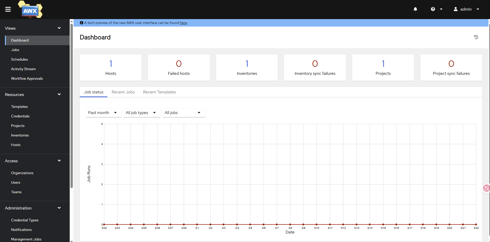

### Projects
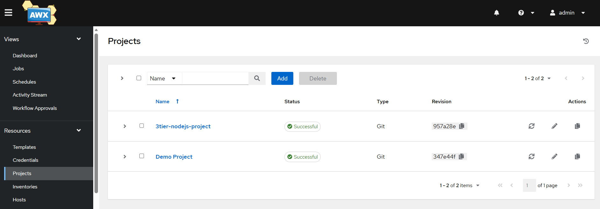

### Inventories
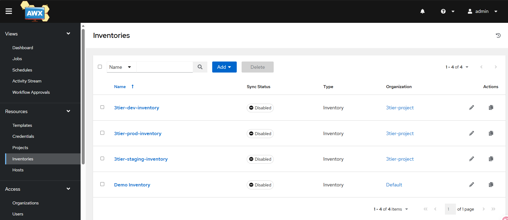

### Credentials
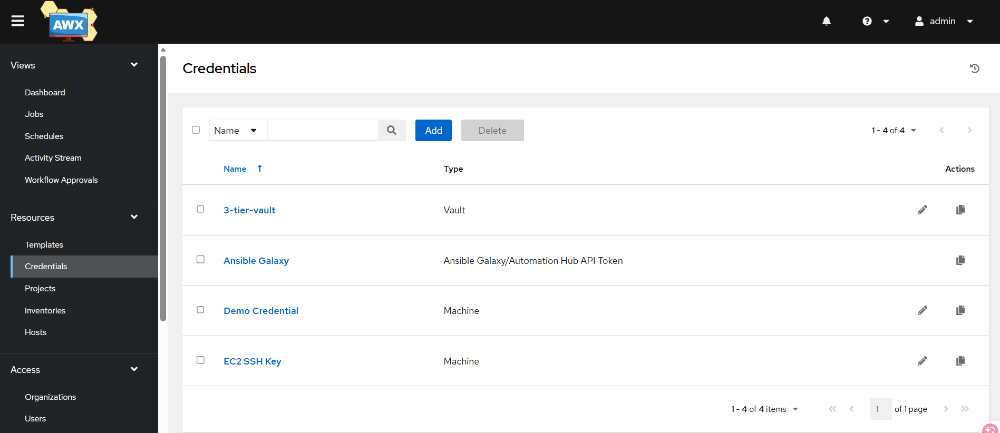

### Templates
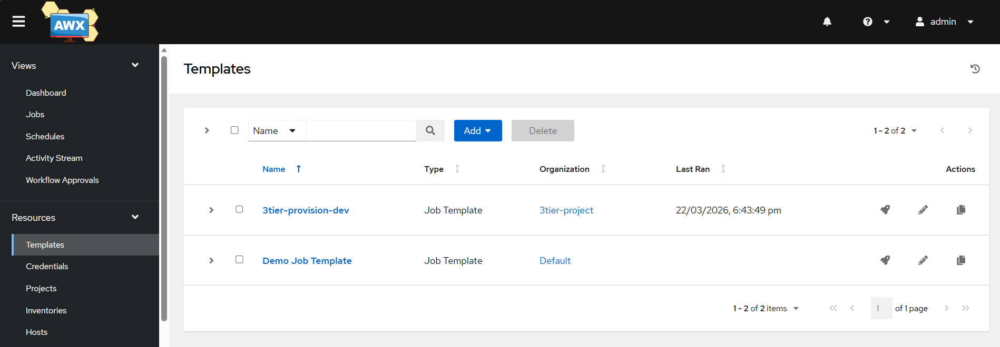

### Launch Configuration
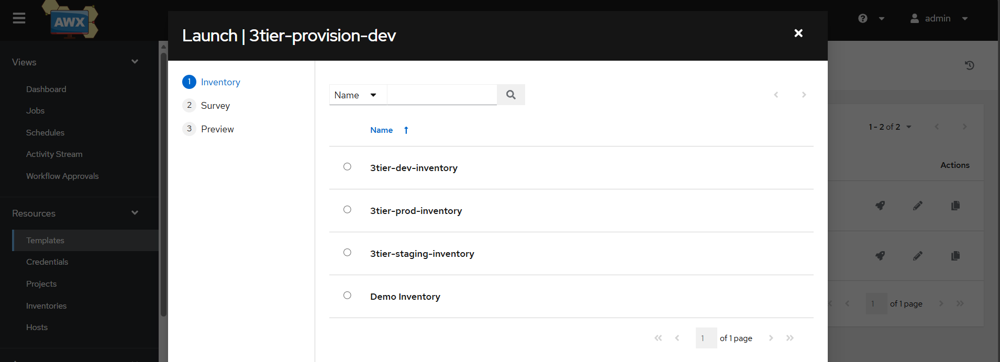

### Job Execution
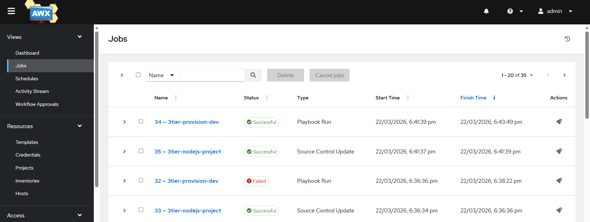

### Job Output
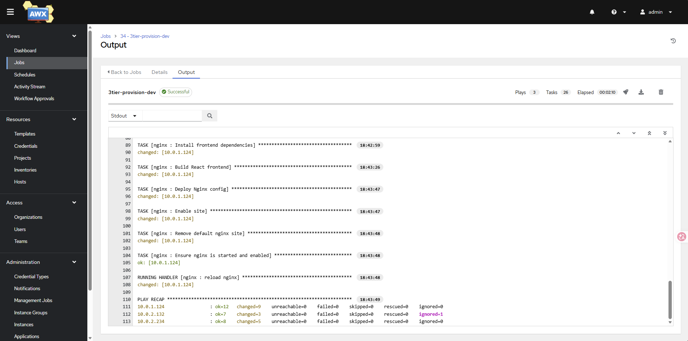
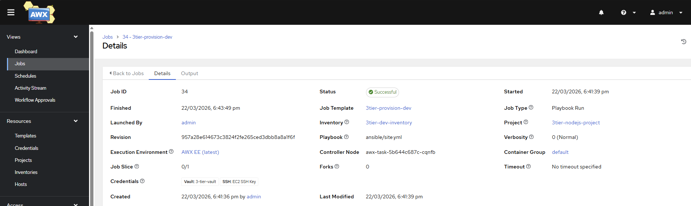

---

## ☸️ Kubernetes (k3s)

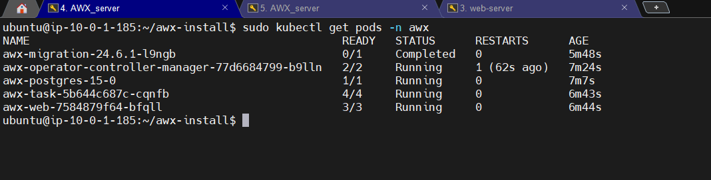
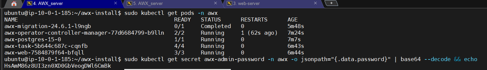

---

## 🌐 Final Application

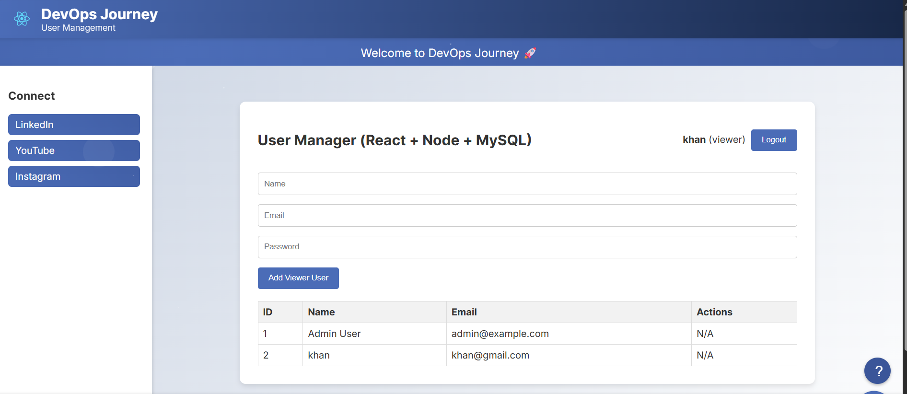

---

## 👨‍💻 Author
Fasih
